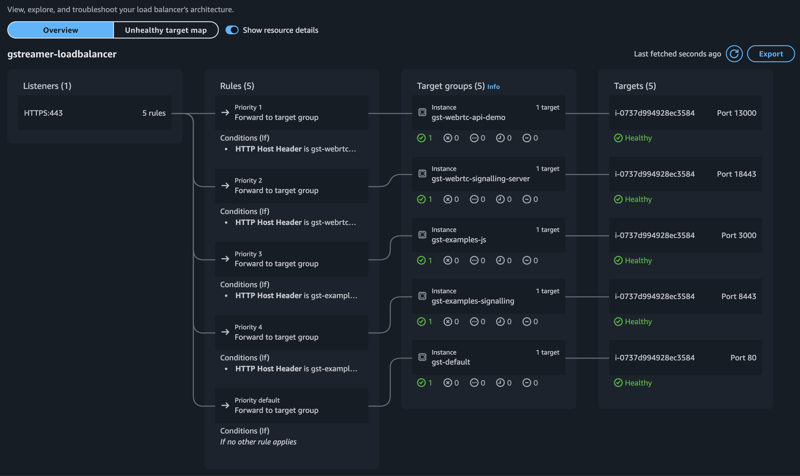
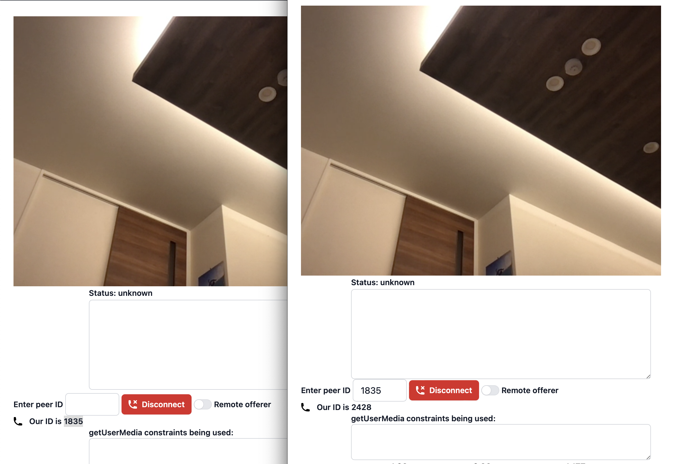
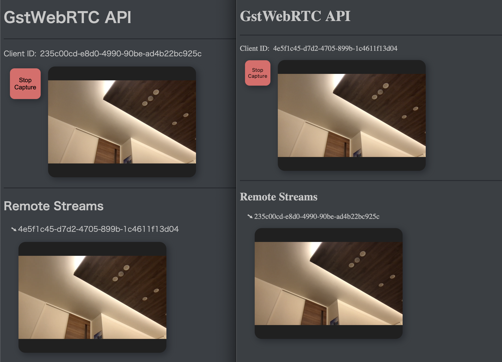

# GStreamer WebRTC Demos: サンプルガイド

このドキュメントでは、GStreamerの公式WebRTCデモをAWS上で構築・実行する方法を説明します。  
ローカル環境で動作させるには独自にコードを調整してください。  
GStreamer（1.24.10）を手動でbuildし、DockerHubを用いてデプロイを行います。

実行は独自ドメインを用いてAWS上で構築することを想定しています。  
DockerのコンテナレジストリはDockerHubを使います。  


### Gstreamerの公式にあるWebRTCサンプルコードは2種類あるようです

* 1つはgst-examplesにあるサンプルコードで、Pythonで書かれたシグナリングサーバを使う方法です。

レポジトリ
https://gitlab.freedesktop.org/gstreamer/gstreamer/-/tree/1.24/subprojects/gst-examples/webrtc/

* もう一つは、Rustで書かれたシグナリングサーバとgstwebrtc-apiを使った例です。  

レポジトリ
https://gitlab.freedesktop.org/gstreamer/gst-plugins-rs/-/tree/gstreamer-1.24.10/net/webrtc/

Web部分はVanilla JSからReact + Viteへ書き換えています。

### 1.GStreamerをbuildしシグナリングサーバをDockerHubにPush
最新のGStreamerを依存関係も含めて統一するため、Debian 12 (Bookworm) のDockerコンテナを利用します。  
以下の順にコンテナイメージをbuildしてください。
DockerHub(xxxxxxx)は取得しているものを使用してください

```bash
# Builderイメージのbuild
cd 1.Docker/1.builder
docker build . -t hexaforce/gstreamer-builder:1.24.10

# Baseイメージのbuild
cd 1.Docker/2.base
docker build . -t hexaforce/gstreamer-base:1.24.10

# Mainイメージのbuild (時間がかかります)
cd 1.Docker/3.main
docker build . -t hexaforce/gstreamer:1.24.10

# Signalling Serverのbuild/push (Rust)
cd 1.Docker/4.gst-webrtc-signalling-server
docker build . -t xxxxxxx/gst-webrtc-signalling-server:1.24.10
docker push xxxxxxx/gst-webrtc-signalling-server:1.24.10

# Signalling Serverのbuild/push (Python)
cd 1.Docker/5.gst-examples-signalling
docker build . -t xxxxxxx/gst-examples-signalling:1.24.10
docker push xxxxxxx/gst-examples-signalling:1.24.10
```

### 2.WebコンテナをbuildしDockerHubにPush
DockerHub(xxxxxxx)は取得しているものを使用してください
```bash
# gstwebrtc-api-demoのbuild/push
cd 2.Web/gst-webrtc-api-demo/gstwebrtc-api
npm install && npm run build
cd ..
npm install && npm run build
docker build . -t xxxxxxx/gst-webrtc-api-demo:1.24.10
docker push xxxxxxx/gst-webrtc-api-demo:1.24.10

# gst-examples-jsのbuild/push
cd 2.Web/gst-examples-js
npm install && npm run build
docker build . -t xxxxxxx/gst-examples-js:1.24.10
docker push xxxxxxx/gst-examples-js:1.24.10
```

### 3.AWSリソースの構築
Terraformを使ってインフラを構築します。  
ドメイン(xxxxxxx.com)はAWSで取得しているものを指定してください。
```bash
cd 3.AWS
terraform plan -var="domain=xxxxxxx.com"
terraform apply -var="domain=xxxxxxx.com"
```

実行が終わったらインスタンスのパブリックDNS/IPが出力されます。
```
Apply complete! Resources: 0 added, 4 changed, 0 destroyed.

Outputs:

gstreamer_demo_instance_public_dns = "ec2-xxx-xxx-xxx-xxx.ap-northeast-1.compute.amazonaws.com"
gstreamer_demo_instance_public_ip = "xxx.xxx.xxx.xxx"
```

出力されたインスタンスのPUBLIC_DNS/IPを設定し、Ansibleを使ってインスタンスにコンテナイメージを起動します。
```bash
cd 3.AWS
export PUBLIC_DNS=ec2-xxx.xxx.xxx.xxx.ap-northeast-1.compute.amazonaws.com
envsubst < inventory.template > inventory.ini
ansible-playbook -i inventory.ini provision.yml --extra-vars "public_ip=xxx.xxx.xxx.xxx"
```

インスタンスに接続するには下記にのコマンドを登録しておくと便利です
```bash
echo "
Host demo
    HostName ec2-xxx.xxx.xxx.xxx.ap-northeast-1.compute.amazonaws.com
    User admin
    IdentityFile ~/.ssh/gstreamer-demo-instance'
" >> ~/.ssh/config

# 次のコマンドだけで接続できます
ssh demo
```

# 下記のように構築できれば完了です


## https://gst-examples-js.hexaforce.io


## https://gst-webrtc-api-demo.hexaforce.io


### 4.デバッグ
コンテナを立ち上げてプログラムを実行し映像が送られるか確認します
```bash
cd 4.Debug
docker compose up --build
# c
docker exec -it 4debug-sendrecv-gst-1 ./webrtc-sendrecv --server=wss://gst-examples-signalling.hexaforce.io --peer-id=xxx
# java 
docker exec -it 4debug-sendrecv-gst-java-1 java -jar /gst-java.jar --server=wss://gst-examples-signalling.hexaforce.io --peer-id=xxx
# python
docker exec -it 4debug-sendrecv-gst-python-1 python -u webrtc_sendrecv.py --server=wss://gst-examples-signalling.hexaforce.io --peer-id=xxx
```

```bash
# Mac
cd 4.Debug/sendrecv/gst-python
brew install gstreamer
brew install libnice-gstreamer
rm -rf  ~/.cache/gstreamer-1.0
python -u webrtc_sendrecv_mac.py --server=wss://gst-examples-signalling.hexaforce.io --peer-id=xxx
```

# Support Plugins

| **Component**     | **H264**                          | **H265**                          | **VP8**                           | **VP9**                           | **AV1**                            |
|-------------------|-----------------------------------|-----------------------------------|-----------------------------------|-----------------------------------|-----------------------------------|
| **Encoder**       | openh264enc                       | x265enc                           | vp8enc                            | vp9enc                            | av1enc                            |
|                   | avenc_h264_omx                    |                                   |                                   |                                   | rav1enc                           |
|                   | x264enc                           |                                   |                                   |                                   | svtav1enc                         |
| **Decoder**       | openh264dec                       | libde265dec                       | vp8dec                            | vp9dec                            | av1dec                            |
|                   | avdec_h264                        | avdec_h265                        | avdec_vp8                         | avdec_vp9                         | dav1ddec                          |
| **Parser**        | h264parse                         | h265parse                         |                                   | vp9parse                          | av1parse                          |
| **Payloader**     | rtph264pay                        | rtph265pay                        | rtpvp8pay                         | rtpvp9pay                         | rtpav1pay                         |
| **DePayloader**   | rtph264depay                      | rtph265depay                      | rtpvp8depay                       | rtpvp9depay                       | rtpav1depay                       |
| **Timestamper**   | h264timestamper                   | h265timestamper                   |                                   |                                   |                                   |
| **JSON Codec**    | h2642json                         | h2652json                         | vp82json                          |                                   | av12json                          |
| **Alpha Decoder** |                                   |                                   | vp8alphadecodebin                 | vp9alphadecodebin                 |                                   |
