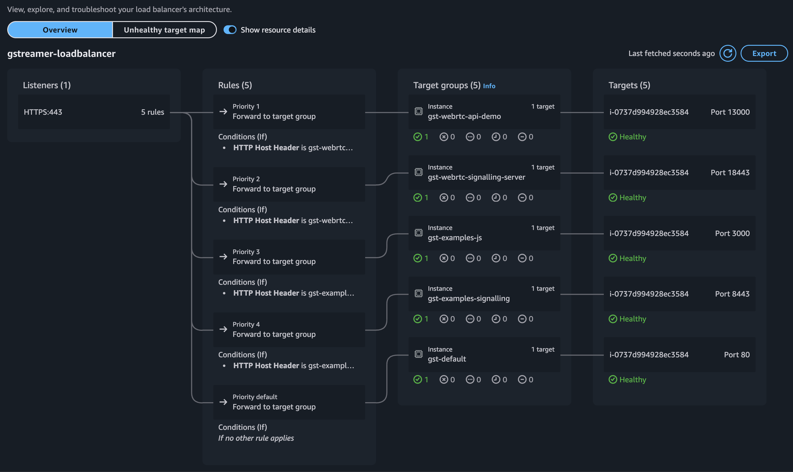

# GStreamer WebRTC Demos: サンプルガイド

このドキュメントでは、GStreamerの公式WebRTCデモをAWS上で構築・実行する方法を説明します。  
GStreamer（1.24.10）を手動でbuildし、DockerHubを用いてデプロイを行います。

実行は独自ドメインを用いてAWS上で構築することを想定しています。  
DockerのコンテナレジストリはDockerHubを使います。  
ローカル環境で動作させるには独自にコードを調整してください

### Gstreamerの公式にあるWebRTCサンプルコードは2種類あるようです

* 1つはgst-examplesにあるサンプルコードで、Pythonで書かれたシグナリングサーバを使う方法です。

レポジトリ
https://gitlab.freedesktop.org/gstreamer/gstreamer/-/tree/1.24/subprojects/gst-examples/webrtc/

* もう一つは、Rustで書かれたシグナリングサーバとgstwebrtc-apiを使った例です。  

レポジトリ
https://gitlab.freedesktop.org/gstreamer/gst-plugins-rs/-/tree/gstreamer-1.24.10/net/webrtc/

公式から取得してフォーマットしたピュアコードはFormattedPlainCodeにあります、差分を確認してください。   
Web部分はVanilla JSからReact + Viteへ書き換えています。

### 1.GStreamerをbuildしシグナリングサーバをDockerHubにPush
最新のGStreamerを依存関係も含めて統一するため、Debian 12 (Bookworm) のDockerコンテナを利用します。  
以下の順にコンテナイメージをbuildしてください。

```bash
# Builderイメージのbuild
cd 1.Docker/1.builder
docker build . -t hexaforce/gstreamer-builder:1.24.10

# Baseイメージのbuild
cd 1.Docker/2.base
docker build . -t hexaforce/gstreamer-base:1.24.10

# Mainイメージのbuild (時間がかかります)
cd 1.Docker/3.main
docker build . -t hexaforce/gstreamer:1.24.10

# Signalling Serverのbuild/push (Rust)
cd 1.Docker/4.gst-webrtc-signalling-server
docker build . -t hexaforce/gst-webrtc-signalling-server:1.24.10
docker push hexaforce/gst-webrtc-signalling-server:1.24.10

# Signalling Serverのbuild/push (Python)
cd 1.Docker/5.gst-examples-signalling
docker build . -t hexaforce/gst-examples-signalling:1.24.10
docker push hexaforce/gst-examples-signalling:1.24.10
```

### 2.WebコンテナをbuildしDockerHubにPush

```bash
# gstwebrtc-api-demoのbuild/push
cd 2.Web/gst-webrtc-api-demo/gstwebrtc-api
npm install && npm run build
cd ..
npm install && npm run build
docker build . -t hexaforce/gst-webrtc-api-demo:1.24.10
docker push hexaforce/gst-webrtc-api-demo:1.24.10

# gst-examples-jsのbuild/push
cd 2.Web/gst-examples-js
npm install && npm run build
docker build . -t hexaforce/gst-examples-js:1.24.10
docker push hexaforce/gst-examples-js:1.24.10
```

### 3.AWSリソースの構築
Terraformを使ってインフラを構築します。  
ドメインはAWSで取得しているものを指定してください。
```bash
cd 3.AWS
terraform plan -var="domain=hexaforce.io"
terraform apply -var="domain=hexaforce.io"
```

実行が終わったらインスタンスのパブリックDNSが出力されます。
```
 Apply complete! Resources: 0 added, 0 changed, 0 destroyed.

Outputs:

gstreamer_demo_instance_public_dns = "ec2-52-195-151-44.ap-northeast-1.compute.amazonaws.com"
```

出力されたインスタンスのPUBLIC_DNSを設定し、Ansibleを使ってインスタンスにコンテナイメージを起動します。
```bash
cd 3.AWS
export PUBLIC_DNS=ec2-52-195-151-44.ap-northeast-1.compute.amazonaws.com
ansible-playbook -i inventory.ini provision.yml
```

# 下記のように構築できれば完了です
